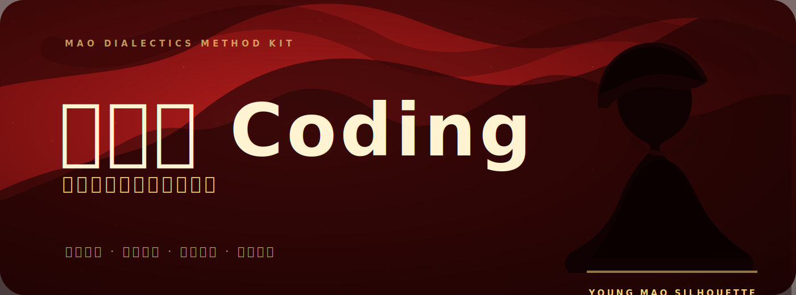

<p align="center">
  
</p>

<p align="center">
  <a href="README.md"></a>
  
  
  
</p>

<br>

---

<br>

<p align="center">
  <b>A complete methodological framework for AI agents,</b><br>
  grounded in the <b>Selected Works of Mao Zedong</b>.<br>
  Covering <b>Dialectical Analysis</b> · <b>Strategic Planning</b> · <b>Brainstorming</b> · <b>Project Execution</b> · <b>Retrospection</b>
</p>

<br>

---

<br>

## 🚀 Five Core Capabilities

<table>
  <tr>
    <td width="20%" align="center">
      <br>
      <b>🧠 Dialectical<br>Analysis</b>
      <br>
      <sub>See contradictions, grasp what matters</sub>
      <br><br>
    </td>
    <td width="20%" align="center">
      <br>
      <b>🔍 Investigation<br>& Research</b>
      <br>
      <sub>No investigation, no right to speak</sub>
      <br><br>
    </td>
    <td width="20%" align="center">
      <br>
      <b>🎯 Strategic<br>Planning</b>
      <br>
      <sub>Stages, trends, direction</sub>
      <br><br>
    </td>
    <td width="20%" align="center">
      <br>
      <b>💡 Brainstorming<br>& Ideas</b>
      <br>
      <sub>Let a hundred flowers bloom</sub>
      <br><br>
    </td>
    <td width="20%" align="center">
      <br>
      <b>♻️ Retrospection<br>& Review</b>
      <br>
      <sub>Learn from practice and history</sub>
      <br><br>
    </td>
  </tr>
</table>

<br>

---

<br>

## 🌟 Dual-Mode Architecture

| Mode | Description |
|------|-------------|
| **Passive** · Always-On | Seven dialectical principles automatically permeate all reasoning output |
| **Active** · On-Demand | Five workflows available: Analysis / Planning / Brainstorming / Execution / Review |

<br>

---

<br>

## 🎯 Problem-Type Routing

Different problems, different methods.

| Problem Type | Core Method Source |
|-------------|-------------------|
| 🧠 Dialectical Analysis | On Contradiction + On Practice |
| 🔍 Investigation | Oppose Bookishness + Hunan Report |
| 🎯 Strategic Planning | Problems of Strategy + Protracted War |
| 🏢 Competitive Landscape | Class Analysis + Strength-Weakness Shift |
| 💡 Brainstorming | Let Hundred Flowers Bloom + Popularization & Elevation |
| 📋 Project Planning | Piano Method + Concentrate Superior Forces |
| ♻️ Retrospection | Study & Current Situation + Rectify Party Style |
| 🌱 New Things Assessment | A Single Spark + Why Red China Exists |
| 🆘 Crisis & Difficulty | Protracted War + Jinggangshan Struggle |
| 🤝 Cooperation & Negotiation | United Front + Reason-Advantage-Restraint |
| 👁️ Situation Assessment | Current Situation + Contradiction |
| 👥 Leadership & Management | Piano Method + General & Specific |

<br>

---

<br>

## 🛠️ Installation

```bash
git clone https://github.com/wangbh030722/mao-dialectics.git
cp -r mao-dialectics ~/.config/opencode/skills/
```

<br>

---

<br>

## 📖 File Structure

```
mao-dialectics/
├── 📄 SKILL.md                        # Core methodology + dual-mode workflow
├── 📄 LICENSE                         # MIT License
├── 📄 README.md                       # Chinese documentation (default)
├── 📄 README.en.md                    # English documentation
├── 🖼️ assets/
│   └── banner.svg                     # Project banner
└── 📚 references/
    ├── problem-routing.md             # Problem type → method routing (16 types)
    ├── contradiction.md               # Theory of Contradiction
    ├── practice.md                    # Theory of Practice
    ├── methodology.md                 # Full 4-volume methodology toolbox
    └── analytical-schema.md           # Analysis templates + case studies
```

<br>

---

<br>

<p align="center">
  <b>Learn Coding from the Party</b> — not ideology, methodology.<br>
  Guided by history, tested by practice, sharpened by dialectics.
</p>

<p align="center">
  <sub>MIT &copy; 2025 <a href="https://github.com/wangbh030722">wangbh030722</a></sub>
</p>
