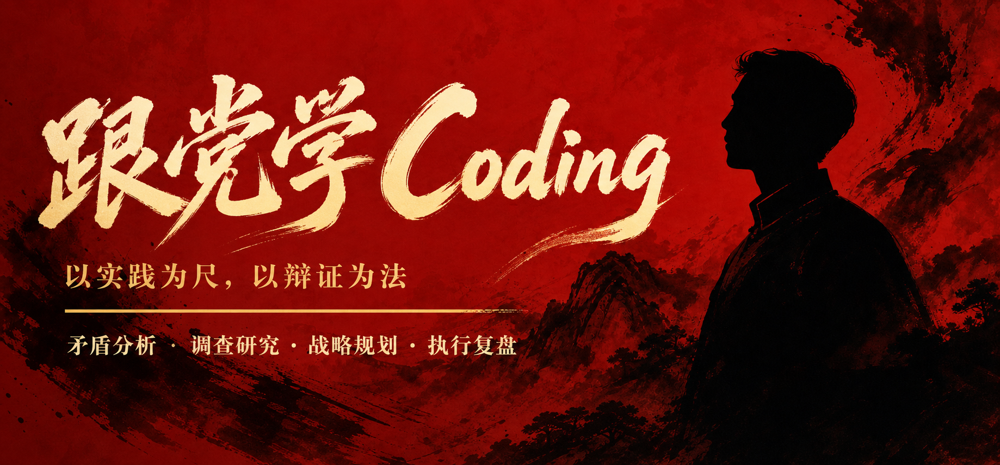
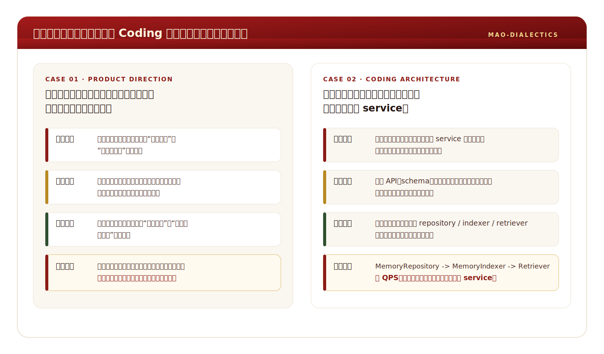

<p align="center">
  
</p>

<p align="center">
  <a href="README.en.md"></a>
  <a href="README.md"></a>
  
  
  
  
</p>

# 跟党学 Coding

**mao-dialectics** 是一个面向 AI Agent 的方法论技能包。它从《毛泽东选集》的辩证法、实践论、调查研究、战略判断与组织方法中提炼可操作的分析框架，用来帮助 Agent 把问题想清楚、把方案排出来、把执行落下去、把经验复盘出来。

## 总览

这个 skill 有两种运行方式：

| 模式 | 说明 |
|------|------|
| 被动模式 Always-On | 作为底层思维框架渗透在所有输出中，自动内化七条辩证原则 |
| 主动模式 On-Demand | 用户显式请求分析、规划、头脑风暴、计划或复盘时，进入结构化工作流 |

七条底层原则：

| # | 原则 | 核心含义 |
|---|------|----------|
| 1 | 矛盾普遍性 | 任何事物内部都包含对立统一的两方面 |
| 2 | 主要矛盾优先 | 抓主要矛盾，不要眉毛胡子一把抓 |
| 3 | 具体问题具体分析 | 不套公式，深入具体条件做判断 |
| 4 | 实践检验原则 | 理论最终要回到实践验证 |
| 5 | 历史发展观点 | 事物处于永恒发展中 |
| 6 | 两点论 | 同时看到正面与反面、主流与支流 |
| 7 | 量变质变警觉 | 注意量变积累到质变跳跃的临界点 |

## 问题类型路由

不同类型的问题用不同的分析方法。详见 `references/problem-routing.md`。

| 问题类型 | 核心方法来源 |
|----------|--------------|
| 战略决策 | 矛盾论 + 持久战阶段论 |
| 竞争格局 | 阶级分析法 + 强弱转化 |
| 组织人事 | 党委会工作方法 + 批评与自我批评 |
| 新生事物 | 星星之火 + 红色政权存在条件 |
| 调查研究 | 反对本本主义 + 湖南考察报告 |
| 危机困难 | 持久战 + 井冈山斗争 |
| 政策制定 | 论政策 + 集中起来坚持下去 |
| 合作谈判 | 统一战线 + 有理有利有节 |
| 形势判断 | 目前形势和任务 + 矛盾论 |
| 领导管理 | 弹钢琴 + 一般与个别结合 |

## 主动工作流

| 工作流 | 输出重点 |
|--------|----------|
| 辩证分析 | 现象定位、矛盾识别、历史溯源、趋势判断、实践建议 |
| 战略规划 | 形势分析、阶段划分、方针制定、部署计划、风险后手 |
| 头脑风暴 | 问题定性、充分发散、去粗取精、普及与提高 |
| 项目计划 | 胸中有数、弹钢琴、集中优势兵力、组织起来 |
| 复盘总结 | 回顾事实、分析原因、自我批评、提炼经验 |

## 使用示例

下面是两类真实使用时的输出形态：一个偏产品方向判断，一个偏 coding 架构决策。它不会急着给结论，而是先把现象、主要矛盾、条件判断和实践建议拆开。

<p align="center">
  
</p>

## 安装

### OpenCode

```bash
git clone https://github.com/wangbh030722/mao-dialectics.git
cp -r mao-dialectics ~/.config/opencode/skills/
```

安装后，在新会话中可直接使用：

```text
skill("mao-dialectics")
```

### Claude Code / Codex / 其他 Agent

```bash
git clone https://github.com/wangbh030722/mao-dialectics.git
```

把仓库中的 `SKILL.md` 作为自定义指令或技能入口加载；需要更完整的方法论上下文时，同时让 Agent 读取 `references/` 目录中的参考文件。

## 文件结构

```text
mao-dialectics/
├── SKILL.md                        # 核心方法论与双模工作流
├── README.md                       # 中文默认首页
├── README.en.md                    # English documentation
├── README.zh.md                    # 中文完整说明
├── assets/
│   ├── banner.png                  # 项目横幅
│   └── example-output.svg          # 使用效果演示图
└── references/
    ├── problem-routing.md          # 问题类型到方法路由
    ├── contradiction.md            # 矛盾论体系详解
    ├── practice.md                 # 实践论体系详解
    ├── methodology.md              # 方法论工具箱
    └── analytical-schema.md        # 分析模板与案例拆解
```

## 许可证

MIT &copy; 2025 [wangbh030722](https://github.com/wangbh030722)
